# EpsteinBrowser — Architecture Documentation

## Table of Contents

- [System Overview](#system-overview)
- [High-Level Architecture](#high-level-architecture)
- [Evented Document Pipeline](#evented-document-pipeline)
- [Pipeline Orchestration (Step Functions)](#pipeline-orchestration-step-functions)
- [Compute Strategy](#compute-strategy)
- [Data Layer](#data-layer)
- [Entity Resolution](#entity-resolution)
- [Claims Extraction & Scoring](#claims-extraction--scoring)
- [AI Integration (Bedrock)](#ai-integration-bedrock)
- [API Design](#api-design)
- [Infrastructure & Environments](#infrastructure--environments)
- [Security](#security)
- [Observability & Monitoring](#observability--monitoring)
- [Network Architecture](#network-architecture)
- [Scalability](#scalability)
- [Disaster Recovery](#disaster-recovery)
- [MVP vs Full Build](#mvp-vs-full-build)

---

## System Overview

EpsteinBrowser is a public-facing web application that scrapes, processes, and indexes the Epstein files from government FOIA releases. It provides a beautiful, queryable UI with full-text search, entity aggregations, and claims-based exploration.

**Core principle:** S3 is the source of truth for raw + derived artifacts. Structured outputs (mentions, entities, claims, scores, evidence spans) are persisted into stores optimized for querying. This is an **evented document pipeline**, not just a DB with documents.

**Priorities**: Scalability, Performance, Data Accuracy.

---

## High-Level Architecture

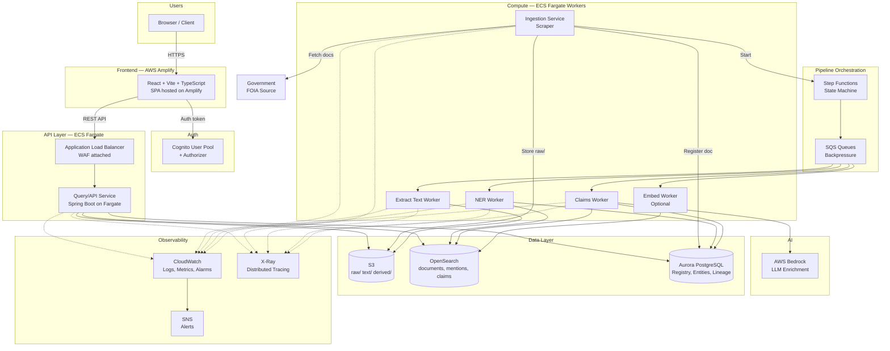

---

## Evented Document Pipeline

The system is designed as an event-driven pipeline. S3 is the immutable source of truth.

### S3 Bucket Structure

```
epstein-{env}-documents/
  raw/          → Original files (PDFs, images, zips) — immutable
  text/         → Extracted text (per page, per doc) — derived
  derived/      → JSON outputs (NER, claims, embeddings, scores)
```

- **Versioning** enabled on all prefixes
- **Object lock** (optional) to prevent accidental deletion of raw files
- **Trigger**: `s3:ObjectCreated` on `raw/` kicks off the pipeline

### Pipeline Trigger Flow

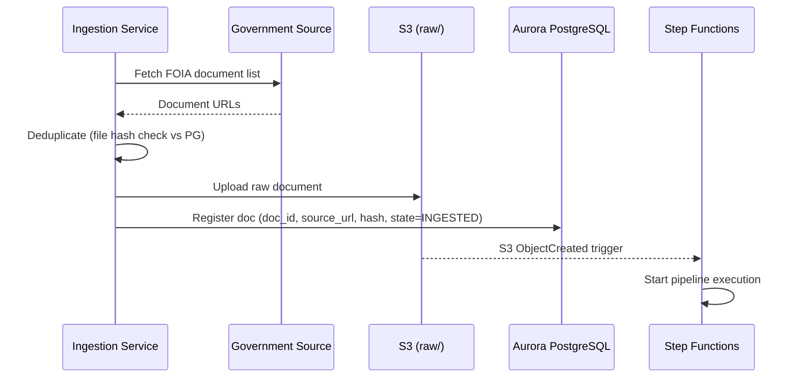

---

## Pipeline Orchestration (Step Functions)

The processing pipeline is orchestrated by AWS Step Functions — retryable, observable, and evolvable. Each stage can be rerun independently.

### State Machine

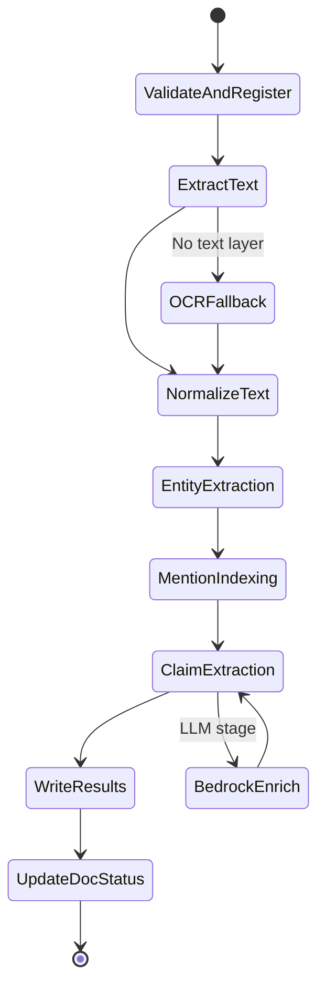

### Pipeline Stages

| Stage | Worker | Input | Output | Store |
|-------|--------|-------|--------|-------|
| 1. Validate & Register | Lambda | S3 event | doc_id, metadata | Aurora |
| 2. Extract Text | `extract-text-worker` (Fargate) | Raw PDF/image from S3 | Per-page text files | S3 `text/` |
| 3. Normalize Text | `extract-text-worker` | Raw text | Cleaned text, page boundaries, metadata | S3 `text/` |
| 4. Entity Extraction (NER) | `ner-worker` (Fargate) | Normalized text | Person/org/location entities | Aurora + OpenSearch |
| 5. Mention Indexing | `ner-worker` | Entities + text | Mention spans with context | OpenSearch `mentions` |
| 6. Claim Extraction | `claims-worker` (Fargate) | Text + entities | Structured claim objects | OpenSearch `claims` + Aurora |
| 7. Write Results | Lambda | All outputs | Derived JSON | S3 `derived/` |
| 8. Update Doc Status | Lambda | Pipeline result | `processing_state=COMPLETE` | Aurora |

### SQS Backpressure

SQS queues sit between stages for work that may build up (e.g., OCR backlog):

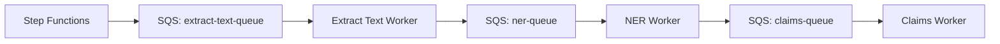

- Dead-letter queues (DLQ) on each for failed messages
- Visibility timeout tuned per stage (OCR: 15 min, NER: 5 min, Claims: 10 min)

---

## Compute Strategy

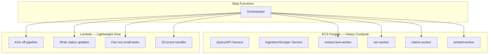

| Component | Runtime | Why |
|-----------|---------|-----|
| API Service | Fargate | Always-on, no cold starts, consistent latency |
| Ingestion Service | Fargate | Long-running scrape jobs, needs stable network |
| Pipeline Workers | Fargate | PDF parsing/OCR is CPU/memory heavy, exceeds Lambda limits |
| Glue functions | Lambda | Short, stateless triggers — no need for containers |

---

## Data Layer

### Where to Store What

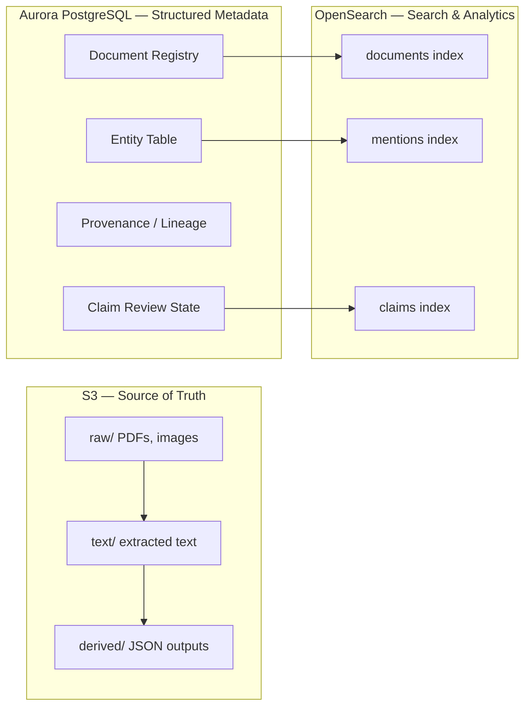

### Aurora PostgreSQL Schema

Used for strong consistency, relational joins, and data lineage.

```sql
-- Document registry
CREATE TABLE documents (
    doc_id          UUID PRIMARY KEY,
    source_url      TEXT NOT NULL,
    file_hash       VARCHAR(64) NOT NULL UNIQUE,
    s3_raw_key      TEXT NOT NULL,
    doc_type        VARCHAR(50),
    upload_time     TIMESTAMP NOT NULL DEFAULT NOW(),
    processing_state VARCHAR(20) NOT NULL DEFAULT 'INGESTED',
    pipeline_version VARCHAR(20),
    page_count      INT,
    created_at      TIMESTAMP NOT NULL DEFAULT NOW(),
    updated_at      TIMESTAMP NOT NULL DEFAULT NOW()
);

-- Page map (links pages to extracted text in S3)
CREATE TABLE pages (
    page_id         UUID PRIMARY KEY,
    doc_id          UUID REFERENCES documents(doc_id),
    page_num        INT NOT NULL,
    s3_text_key     TEXT NOT NULL,
    char_offset_start INT,
    char_offset_end INT,
    UNIQUE(doc_id, page_num)
);

-- Canonical entities (people, organizations, locations)
CREATE TABLE entities (
    entity_id       UUID PRIMARY KEY,
    canonical_name  TEXT NOT NULL,
    entity_type     VARCHAR(20) NOT NULL, -- PERSON, ORG, LOCATION
    known_aliases   TEXT[],
    created_at      TIMESTAMP NOT NULL DEFAULT NOW(),
    updated_at      TIMESTAMP NOT NULL DEFAULT NOW()
);

-- Claims with review state
CREATE TABLE claims (
    claim_id        UUID PRIMARY KEY,
    claim_text      TEXT NOT NULL,
    claim_type      VARCHAR(50),
    severity_score  FLOAT,
    confidence      FLOAT,
    review_state    VARCHAR(20) NOT NULL DEFAULT 'UNREVIEWED',
    pipeline_version VARCHAR(20),
    model_version   VARCHAR(50),
    created_at      TIMESTAMP NOT NULL DEFAULT NOW()
);

-- Provenance tracking
CREATE TABLE pipeline_runs (
    run_id          UUID PRIMARY KEY,
    doc_id          UUID REFERENCES documents(doc_id),
    pipeline_version VARCHAR(20) NOT NULL,
    model_version   VARCHAR(50),
    started_at      TIMESTAMP NOT NULL,
    completed_at    TIMESTAMP,
    status          VARCHAR(20) NOT NULL
);
```

### OpenSearch Index Mappings

Three indices optimized for search and aggregations.

#### `documents` index

```json
{
  "mappings": {
    "properties": {
      "doc_id":           { "type": "keyword" },
      "source_url":       { "type": "keyword" },
      "title":            { "type": "text", "analyzer": "standard" },
      "doc_type":         { "type": "keyword" },
      "document_date":    { "type": "date" },
      "indexed_at":       { "type": "date" },
      "full_text":        { "type": "text", "analyzer": "standard" },
      "page_count":       { "type": "integer" },
      "file_hash":        { "type": "keyword" },
      "processing_state": { "type": "keyword" }
    }
  }
}
```

#### `mentions` index (one record per mention span)

```json
{
  "mappings": {
    "properties": {
      "mention_id":     { "type": "keyword" },
      "entity_id":      { "type": "keyword" },
      "entity_type":    { "type": "keyword" },
      "surface_text":   { "type": "text" },
      "canonical_name": { "type": "keyword" },
      "doc_id":         { "type": "keyword" },
      "page_num":       { "type": "integer" },
      "start_offset":   { "type": "integer" },
      "end_offset":     { "type": "integer" },
      "context_window": { "type": "text" }
    }
  }
}
```

#### `claims` index (one record per extracted claim)

```json
{
  "mappings": {
    "properties": {
      "claim_id":         { "type": "keyword" },
      "claim_text":       { "type": "text", "analyzer": "standard" },
      "claim_type":       { "type": "keyword" },
      "severity_score":   { "type": "float" },
      "specificity_score": { "type": "float" },
      "evidence_density": { "type": "float" },
      "confidence":       { "type": "float" },
      "composite_score":  { "type": "float" },
      "review_state":     { "type": "keyword" },
      "entity_ids":       { "type": "keyword" },
      "evidence_spans": {
        "type": "nested",
        "properties": {
          "doc_id":       { "type": "keyword" },
          "page_num":     { "type": "integer" },
          "start_offset": { "type": "integer" },
          "end_offset":   { "type": "integer" },
          "quoted_text":  { "type": "text" }
        }
      }
    }
  }
}
```

#### Key Aggregation Queries

**Top mentioned entities ("top names"):**
```json
{
  "size": 0,
  "aggs": {
    "top_entities": {
      "terms": { "field": "entity_id", "size": 50 },
      "aggs": {
        "name": { "terms": { "field": "canonical_name", "size": 1 } }
      }
    }
  }
}
```

**Highest severity claims:**
```json
{
  "size": 20,
  "sort": [{ "composite_score": "desc" }],
  "query": {
    "bool": {
      "filter": [
        { "term": { "review_state": "APPROVED" } }
      ]
    }
  }
}
```

---

## Entity Resolution

Counting string occurrences is easy; counting **people** is harder. The pipeline resolves entities correctly.

### Entity Resolution Pipeline

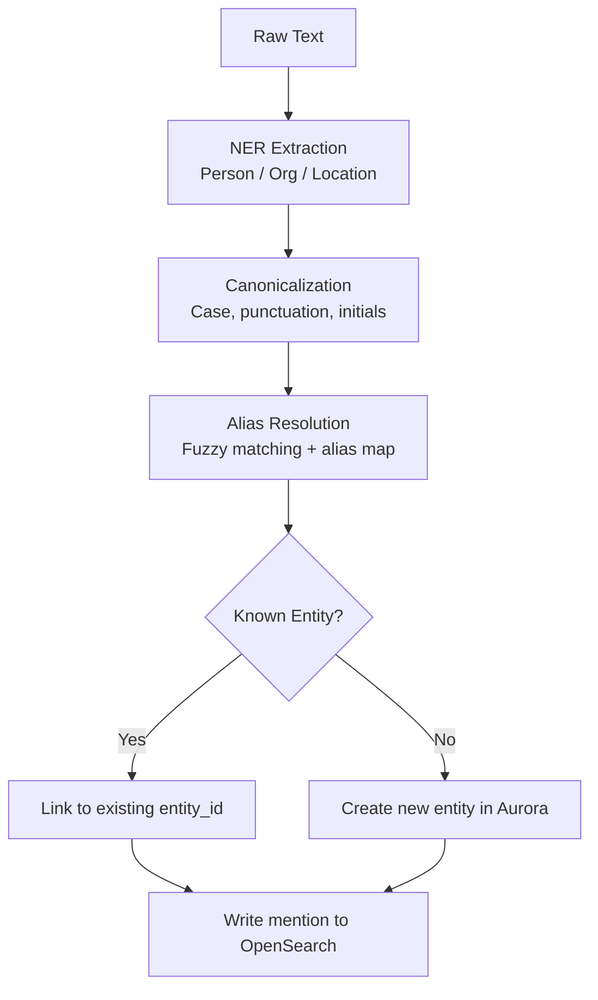

### Canonicalization Rules

1. Normalize case, punctuation, whitespace
2. Expand/match initials ("J. Epstein" → "Jeffrey Epstein")
3. Alias map stored in Aurora `entities.known_aliases[]`
4. Fuzzy matching threshold for new candidates
5. Manual merge tooling for ambiguous cases (future admin UI)

---

## Claims Extraction & Scoring

Claims are structured, evidence-backed objects — not raw LLM output.

### Claim Object Structure

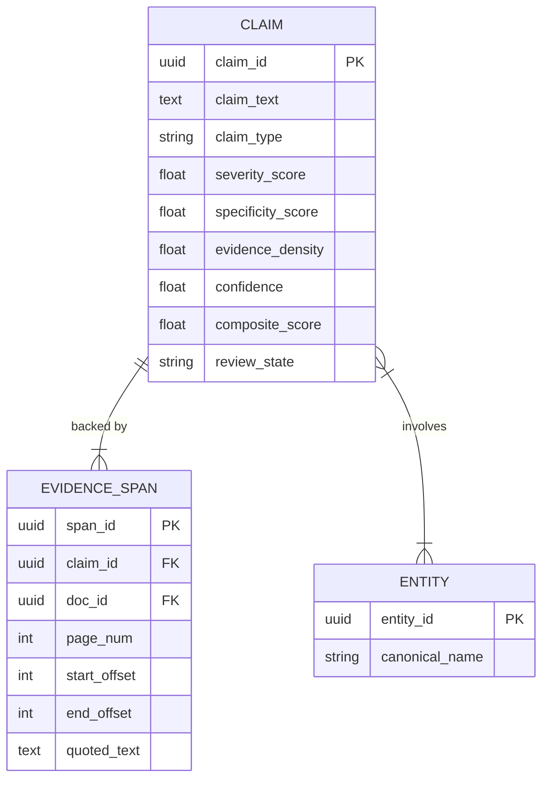

### Scoring Model

Claims are ranked by a transparent, explainable composite score:

| Factor | Weight | Description |
|--------|--------|-------------|
| Severity category | 0.30 | Rule-based + LLM-classified severity (taxonomy) |
| Specificity | 0.25 | Named parties? Concrete actions? Dates? |
| Evidence density | 0.25 | Multiple documents/pages referencing same claim |
| Confidence | 0.20 | Extraction confidence + cross-source consistency |

**`composite_score`** = weighted sum of normalized factors.

### Review States

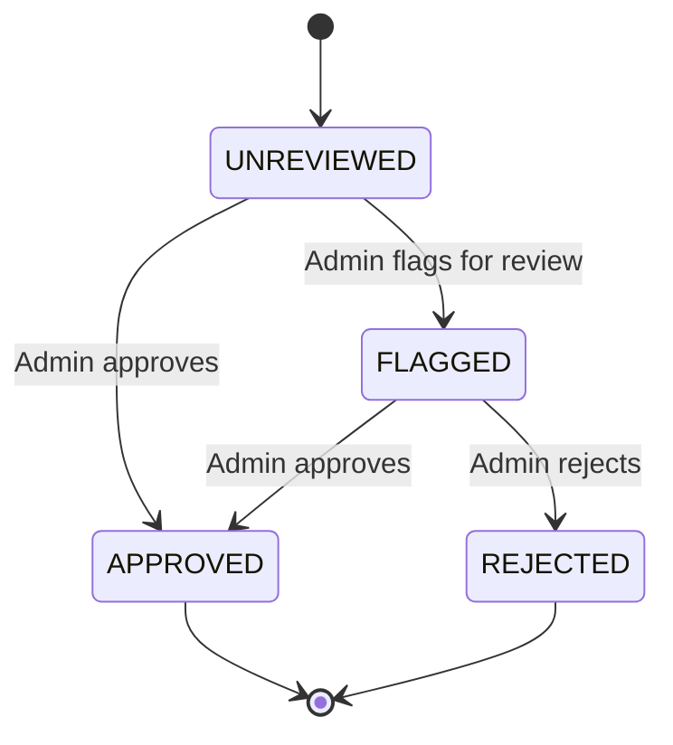

UI labels should use "highest severity / highest confidence claims" rather than subjective terms.

---

## AI Integration (Bedrock)

AWS Bedrock is used for **offline enrichment only** — never in the user request path.

### Where AI Is Used

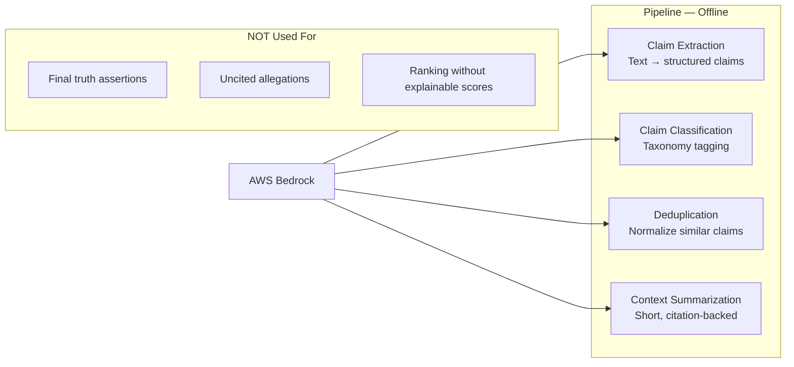

### Bedrock Integration Design

- Called from `claims-worker` via AWS SDK
- Guardrails enabled (content filtering)
- All calls logged to CloudWatch
- Outputs stored as deterministic JSON in S3 `derived/`
- Model version tracked in `pipeline_runs` table — re-runnable as models improve
- **Idempotent**: same input + model version → same output

---

## API Design

### Services

Two Spring Boot services on Fargate:

**1. Ingestion Service** (write path)
- Accepts URLs / triggers scraping
- Writes to S3
- Registers docs in Aurora
- Starts Step Functions execution

**2. Query/API Service** (read path)
- Read-only, no heavy processing
- Queries OpenSearch for search/aggregations
- Queries Aurora for metadata/entity details
- Generates presigned S3 URLs for raw documents

### Endpoints

| Method | Path | Description | Data Source |
|--------|------|-------------|-------------|
| `GET` | `/api/v1/search` | Full-text search with filters, pagination | OpenSearch |
| `GET` | `/api/v1/documents/{id}` | Document metadata | Aurora + OpenSearch |
| `GET` | `/api/v1/documents/{id}/content` | Presigned S3 URL for raw doc | S3 |
| `GET` | `/api/v1/documents/{id}/pages` | Page-level text + metadata | Aurora + S3 |
| `GET` | `/api/v1/entities/top` | Top mentioned entities with counts | OpenSearch agg |
| `GET` | `/api/v1/entities/{id}` | Entity detail + aliases | Aurora |
| `GET` | `/api/v1/entities/{id}/mentions` | All mentions with context | OpenSearch |
| `GET` | `/api/v1/claims/top` | Highest scored claims | OpenSearch |
| `GET` | `/api/v1/claims/{id}` | Claim detail + evidence spans + linked docs | OpenSearch + Aurora |
| `GET` | `/api/v1/stats/overview` | Aggregate stats (total docs, entities, claims) | OpenSearch |
| `GET` | `/api/v1/stats/timeline` | Document count by date | OpenSearch |
| `GET` | `/api/v1/health` | Health check | Internal |
| `POST` | `/api/v1/ingest` | Trigger scrape/ingest (admin only) | Ingestion Service |

---

## Infrastructure & Environments

Two environments — **dev** and **staging** — with identical resource topology, differentiated by prefix.

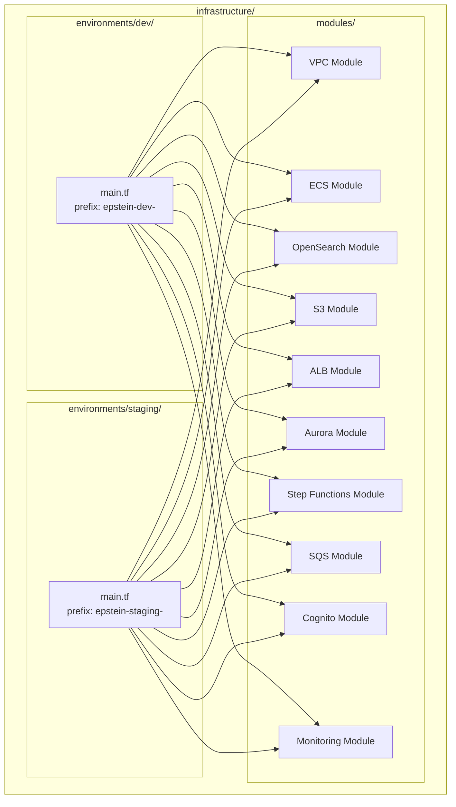

| Environment | Resource Prefix | Purpose |
|-------------|-----------------|---------|
| **dev** | `epstein-dev-` | Development and local testing |
| **staging** | `epstein-staging-` | Pre-production validation |

---

## Security

### Architecture

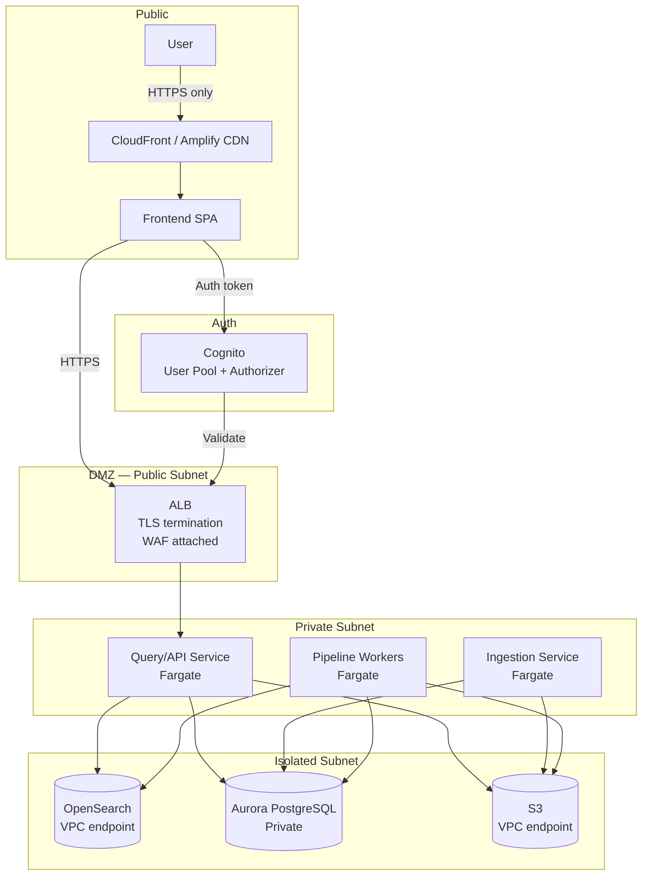

### Security Controls

| Layer | Control | Details |
|-------|---------|---------|
| **Network** | VPC isolation | Fargate, Aurora, and OpenSearch in private/isolated subnets; no public IPs on compute |
| **Network** | Security groups | Least-privilege ingress/egress per service |
| **Network** | VPC endpoints | S3 and OpenSearch accessed via VPC endpoints, no internet transit |
| **Edge** | WAF | AWS WAF on ALB — rate limiting, OWASP top-10 rule set |
| **Edge** | TLS | TLS 1.2+ enforced on ALB and Amplify CDN |
| **Auth** | Cognito | User pool + authorizer on API Gateway/ALB for frontend-to-API auth |
| **Auth** | Admin separation | Ingest/admin endpoints require elevated Cognito group |
| **Data** | Encryption at rest | S3 SSE-S3, Aurora encryption, OpenSearch node-to-node encryption |
| **Data** | Encryption in transit | All inter-service communication over TLS |
| **Data** | Redaction controls | Raw text stored; optional "safe excerpt" for UI display |
| **IAM** | Least privilege | Task roles per Fargate service/worker with minimal permissions |
| **IAM** | No long-lived credentials | Fargate uses IAM task roles, no hardcoded keys |
| **Secrets** | Secrets Manager | DB credentials, API keys, external credentials |
| **Supply chain** | ECR image scanning | Vulnerability scanning on push |
| **Logging** | Audit trail | CloudTrail enabled, all API calls logged |
| **AI** | Bedrock guardrails | Content filtering on all LLM calls, all calls logged |

### Data Integrity

| Control | Details |
|---------|---------|
| **Idempotent ingestion** | Document file hash as natural key; prevents double-ingest |
| **Versioned outputs** | Pipeline version + model version stored with every derived artifact |
| **S3 versioning** | All prefixes versioned; reprocessing doesn't destroy history |
| **Object lock** | Optional write-once protection on `raw/` prefix |

---

## Observability & Monitoring

### Observability Stack

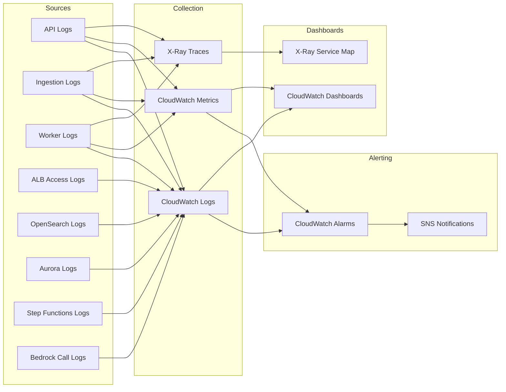

### Key Metrics & Alarms

| Metric | Source | Alarm Threshold | Action |
|--------|--------|----------------|--------|
| API response time (p99) | ALB target group | > 2s for 5 min | SNS alert |
| API error rate (5xx) | ALB | > 5% for 3 min | SNS alert |
| Fargate CPU utilization | ECS | > 80% for 10 min | Auto-scale + SNS alert |
| Fargate memory utilization | ECS | > 80% for 10 min | Auto-scale + SNS alert |
| OpenSearch cluster health | OpenSearch | RED for 1 min | SNS critical alert |
| OpenSearch free storage | OpenSearch | < 20% | SNS alert |
| OpenSearch JVM memory pressure | OpenSearch | > 80% for 15 min | SNS alert |
| Aurora CPU utilization | RDS | > 80% for 10 min | SNS alert |
| Aurora connection count | RDS | > 80% of max | SNS alert |
| Pipeline execution failures | Step Functions | Any failure | SNS alert |
| Pipeline execution duration | Step Functions | > 30 min (single doc) | SNS alert |
| SQS DLQ message count | SQS | > 0 | SNS alert |
| Bedrock latency | CloudWatch | > 30s per call | SNS alert |
| Bedrock throttling | CloudWatch | Any throttle | SNS alert |
| Docs processed per hour | Custom metric | < expected threshold | Dashboard + SNS |
| OCR failure rate | Custom metric | > 5% | SNS alert |
| S3 bucket size | S3 | Informational | Dashboard only |
| 4xx error rate | ALB | > 10% for 5 min | SNS alert |

### Logging Strategy

| Service | Log Group | Retention | Format |
|---------|-----------|-----------|--------|
| Query API | `/ecs/epstein-{env}-api` | 30 days | JSON structured |
| Ingestion Service | `/ecs/epstein-{env}-ingestion` | 30 days | JSON structured |
| Extract Text Worker | `/ecs/epstein-{env}-extract-text` | 30 days | JSON structured |
| NER Worker | `/ecs/epstein-{env}-ner` | 30 days | JSON structured |
| Claims Worker | `/ecs/epstein-{env}-claims` | 30 days | JSON structured |
| Step Functions | `/aws/states/epstein-{env}-pipeline` | 30 days | Step Functions standard |
| ALB | `epstein-{env}-alb-access-logs` (S3) | 90 days | ALB standard |
| OpenSearch | `/aws/opensearch/epstein-{env}` | 14 days | OpenSearch standard |
| Aurora | `/aws/rds/epstein-{env}` | 14 days | PostgreSQL standard |
| Bedrock | `/aws/bedrock/epstein-{env}` | 30 days | JSON structured |

### Structured Log Format

All application logs use JSON structured logging:

```json
{
  "timestamp": "ISO-8601",
  "level": "INFO|WARN|ERROR",
  "service": "api|ingestion|extract-text|ner|claims",
  "traceId": "uuid",
  "docId": "uuid (when applicable)",
  "pipelineRunId": "uuid (when applicable)",
  "message": "description",
  "metadata": {}
}
```

### Distributed Tracing

- AWS X-Ray integrated with Spring Boot via `aws-xray-sdk`
- Trace IDs propagated across all services: API → OpenSearch, API → Aurora, API → S3
- Pipeline trace: Step Functions → Workers → Data stores
- X-Ray service map provides visual dependency graph

---

## Network Architecture

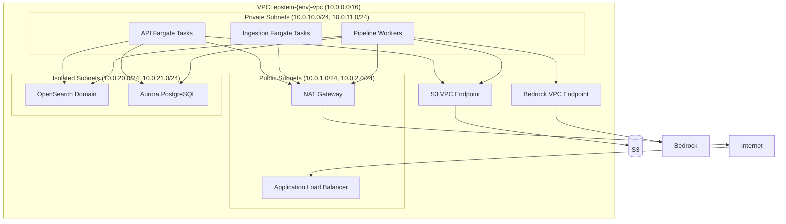

- **Multi-AZ**: All subnets span 2 AZs for high availability
- **NAT Gateway**: Outbound internet for Fargate tasks (scraper needs to reach government sources)
- **VPC Endpoints**: S3, Bedrock accessed without internet transit
- **No public IPs** on any Fargate task, Aurora instance, or OpenSearch node

---

## Scalability

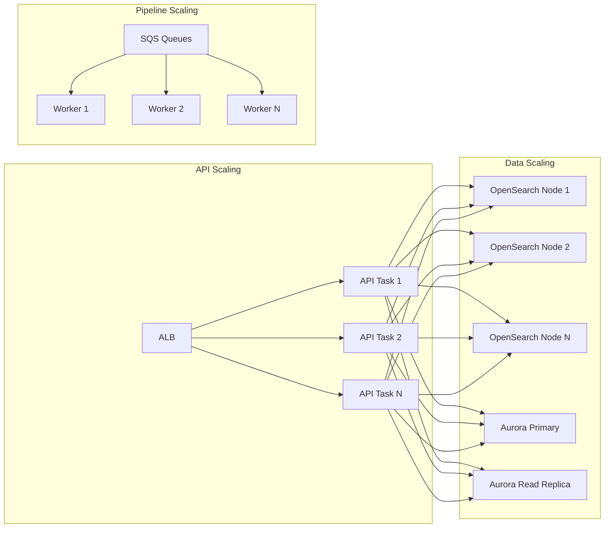

| Component | Scaling Strategy |
|-----------|-----------------|
| **Frontend** | Amplify CDN — globally distributed, auto-scales |
| **API Service** | ECS auto-scaling on CPU/memory; min 2 tasks |
| **Pipeline Workers** | Scale with SQS queue depth; Fargate tasks spin up/down per demand |
| **OpenSearch** | Horizontal: add data nodes + index sharding. Vertical: instance size |
| **Aurora** | Vertical: instance size. Horizontal: read replicas for query load |
| **Step Functions** | Serverless, scales automatically |
| **SQS** | Serverless, scales automatically |
| **S3** | Effectively unlimited |

---

## Disaster Recovery

| Component | RPO | RTO | Strategy |
|-----------|-----|-----|----------|
| **S3 (raw + derived)** | 0 | Minutes | S3 versioning + cross-region replication |
| **Aurora PostgreSQL** | 5 min | < 30 min | Automated backups, point-in-time recovery, optional cross-region replica |
| **OpenSearch** | < 1 hour | < 1 hour | Automated snapshots to S3, restore to new domain |
| **Fargate** | N/A | Minutes | Stateless; redeploy from ECR image |
| **Step Functions** | N/A | Minutes | Stateless; redeploy via Terraform |
| **Frontend** | N/A | Minutes | Redeploy from git via Amplify |
| **Infrastructure** | N/A | < 1 hour | Terraform state in S3 + DynamoDB lock; re-apply |

---

## MVP vs Full Build

### MVP (fastest path to value)

1. S3 raw + extracted text
2. Step Functions + ECS worker for text extraction
3. OpenSearch indexing (documents + mentions)
4. Aurora for document registry + entity table
5. Java Query API for "top entities" + "search mentions"
6. React frontend with stats dashboard + search

### Full Build (add incrementally)

7. Claims extraction pipeline branch
8. Bedrock enrichment for claim classification
9. Claims scoring + review workflow
10. Embeddings + vector search ("find similar claims")
11. Admin UI for entity merges + claim review
12. Cognito auth with admin groups
