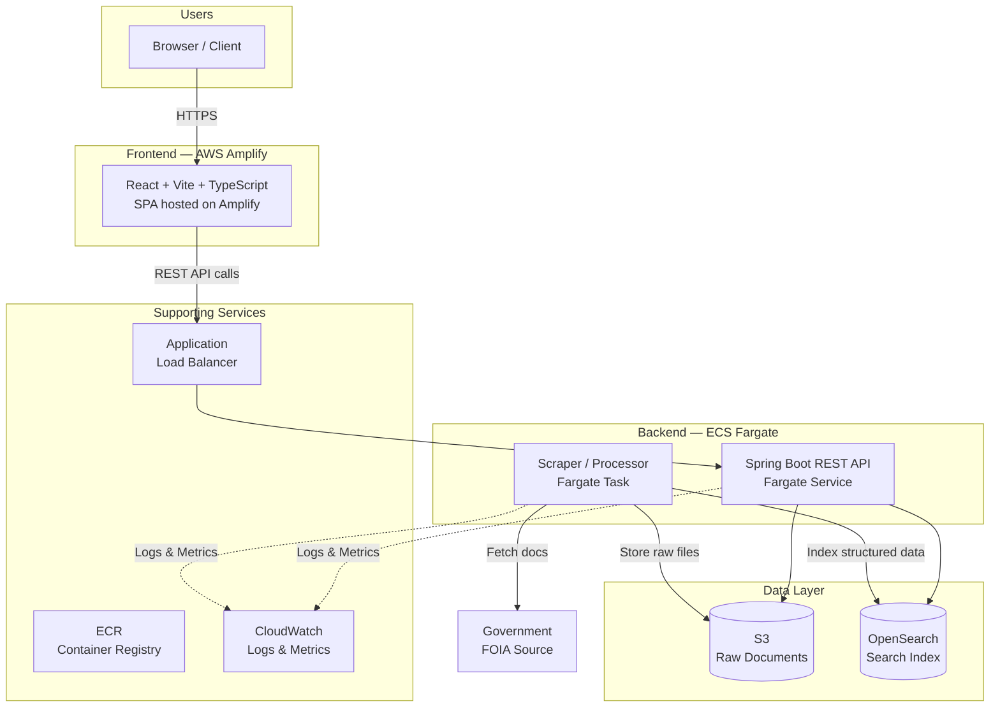
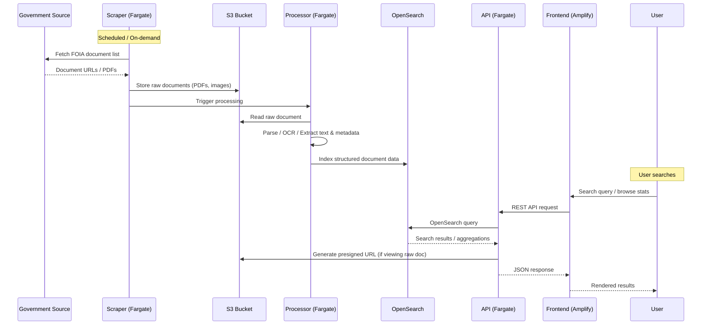
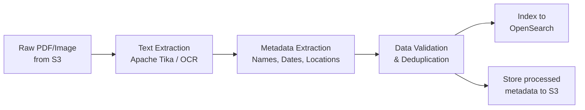
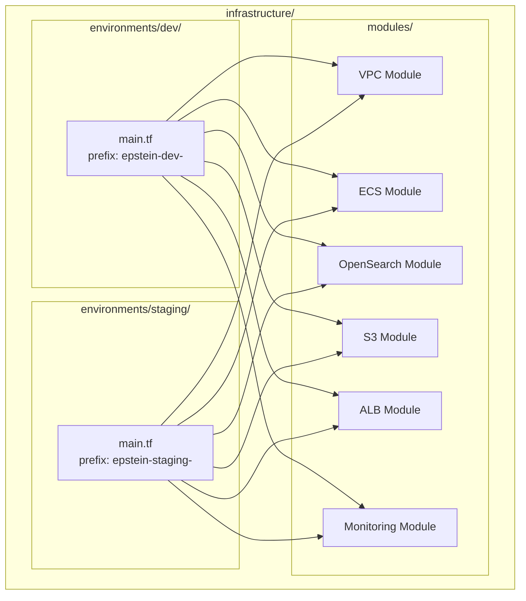
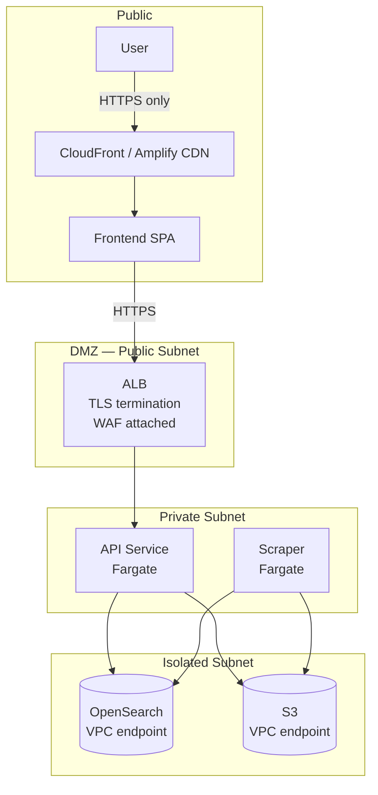
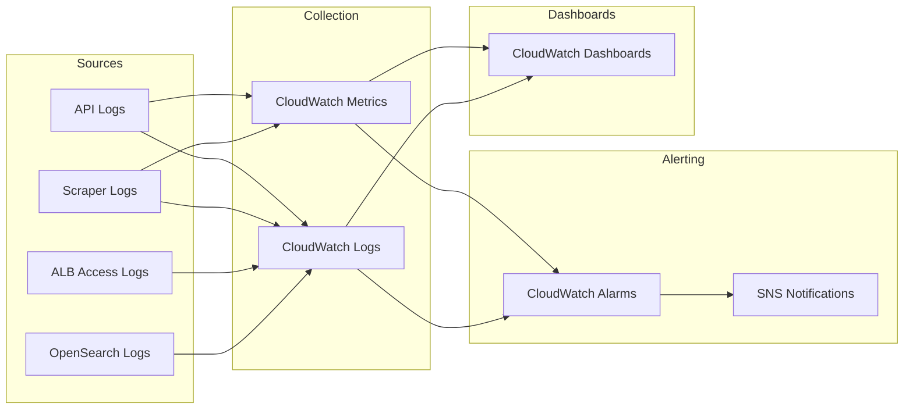
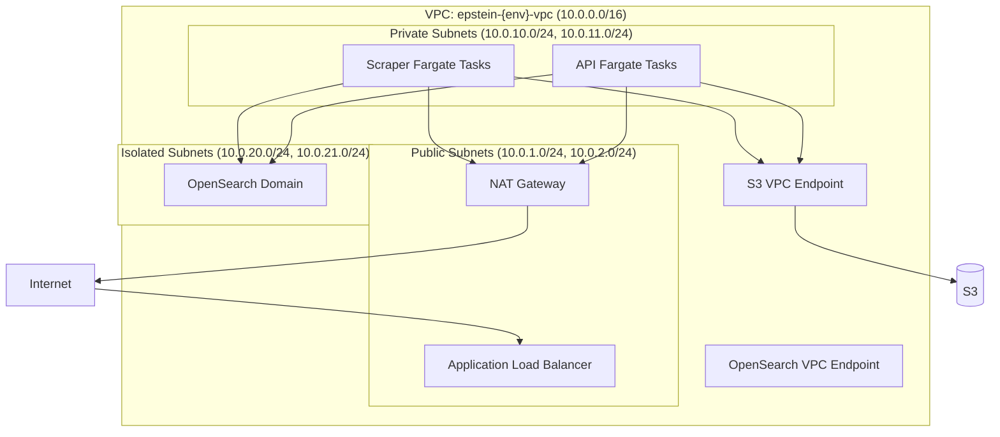
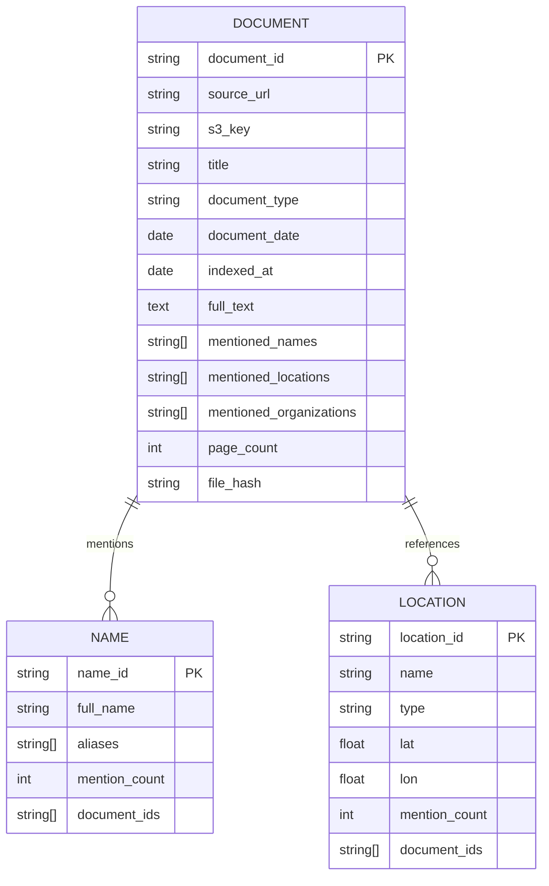
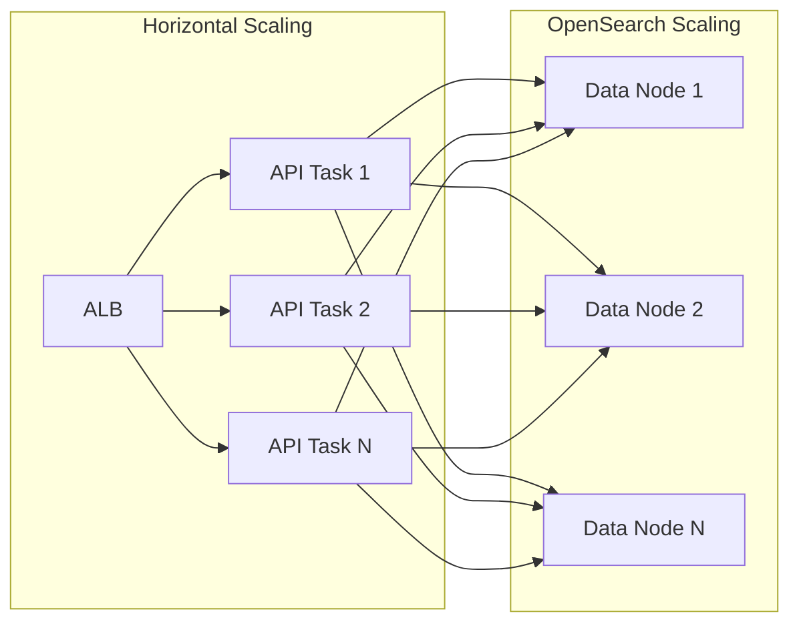

# EpsteinBrowser — Architecture Documentation

## Table of Contents

- [System Overview](#system-overview)
- [High-Level Architecture](#high-level-architecture)
- [Data Flow](#data-flow)
- [Infrastructure & Environments](#infrastructure--environments)
- [Security](#security)
- [Observability & Monitoring](#observability--monitoring)
- [Network Architecture](#network-architecture)
- [Data Model](#data-model)
- [API Design](#api-design)
- [Scalability](#scalability)
- [Disaster Recovery](#disaster-recovery)

---

## System Overview

EpsteinBrowser is a public-facing web application that scrapes, processes, and indexes the Epstein files from government FOIA releases. It provides a beautiful, queryable UI for exploring the data with full-text search, aggregations, and statistical dashboards.

**Priorities**: Scalability, Performance, Data Accuracy.

---

## High-Level Architecture



---

## Data Flow



### Processing Pipeline Detail



---

## Infrastructure & Environments

Two environments — **dev** and **staging** — with identical resource topology, differentiated by prefix.



| Environment | Resource Prefix | Purpose |
|-------------|-----------------|---------|
| **dev** | `epstein-dev-` | Development and local testing |
| **staging** | `epstein-staging-` | Pre-production validation |

---

## Security

### Architecture



### Security Controls

| Layer | Control | Details |
|-------|---------|---------|
| **Network** | VPC isolation | Fargate and OpenSearch in private subnets; no public IPs on compute |
| **Network** | Security groups | Least-privilege ingress/egress per service |
| **Network** | VPC endpoints | S3 and OpenSearch accessed via VPC endpoints, no internet transit |
| **Edge** | WAF | AWS WAF on ALB — rate limiting, OWASP top-10 rule set |
| **Edge** | TLS | TLS 1.2+ enforced on ALB and Amplify CDN |
| **Auth** | API authentication | API keys or Cognito tokens for frontend-to-API calls |
| **Data** | Encryption at rest | S3 SSE-S3, OpenSearch node-to-node encryption, EBS encryption |
| **Data** | Encryption in transit | All inter-service communication over TLS |
| **IAM** | Least privilege | Task roles per Fargate service with minimal permissions |
| **IAM** | No long-lived credentials | Fargate uses IAM task roles, no hardcoded keys |
| **Secrets** | AWS Secrets Manager | API keys, external credentials stored in Secrets Manager |
| **Supply chain** | ECR image scanning | Vulnerability scanning on push |
| **Logging** | Audit trail | CloudTrail enabled, all API calls logged |

---

## Observability & Monitoring

### Observability Stack



### Key Metrics & Alarms

| Metric | Source | Alarm Threshold | Action |
|--------|--------|----------------|--------|
| API response time (p99) | ALB target group | > 2s for 5 min | SNS alert |
| API error rate (5xx) | ALB | > 5% for 3 min | SNS alert |
| Fargate CPU utilization | ECS | > 80% for 10 min | Auto-scale + SNS alert |
| Fargate memory utilization | ECS | > 80% for 10 min | Auto-scale + SNS alert |
| OpenSearch cluster health | OpenSearch | RED for 1 min | SNS alert (critical) |
| OpenSearch free storage | OpenSearch | < 20% | SNS alert |
| OpenSearch JVM memory pressure | OpenSearch | > 80% for 15 min | SNS alert |
| Scraper task failures | ECS task status | Any failure | SNS alert |
| S3 bucket size | S3 | Informational | Dashboard only |
| 4xx error rate | ALB | > 10% for 5 min | SNS alert |

### Logging Strategy

| Service | Log Group | Retention | Format |
|---------|-----------|-----------|--------|
| API | `/ecs/epstein-{env}-api` | 30 days | JSON structured |
| Scraper | `/ecs/epstein-{env}-scraper` | 30 days | JSON structured |
| ALB | `epstein-{env}-alb-access-logs` (S3) | 90 days | ALB standard |
| OpenSearch | `/aws/opensearch/epstein-{env}` | 14 days | OpenSearch standard |

### Structured Log Format

All application logs use JSON structured logging:

```json
{
  "timestamp": "ISO-8601",
  "level": "INFO|WARN|ERROR",
  "service": "api|scraper|processor",
  "traceId": "uuid",
  "message": "description",
  "metadata": {}
}
```

### Distributed Tracing

- AWS X-Ray integrated with Spring Boot via `aws-xray-sdk`
- Trace IDs propagated across API → OpenSearch and API → S3 calls
- X-Ray service map provides visual dependency graph

---

## Network Architecture



- **Multi-AZ**: All subnets span 2 AZs for high availability
- **NAT Gateway**: Outbound internet for Fargate tasks (scraper needs to reach government sources)
- **No public IPs** on any Fargate task or OpenSearch node

---

## Data Model

### OpenSearch Index Schema



---

## API Design

### Endpoints

| Method | Path | Description |
|--------|------|-------------|
| `GET` | `/api/v1/search` | Full-text search with filters, pagination |
| `GET` | `/api/v1/documents/{id}` | Get single document metadata |
| `GET` | `/api/v1/documents/{id}/content` | Get presigned S3 URL for raw document |
| `GET` | `/api/v1/stats/overview` | Aggregate stats (total docs, names, locations) |
| `GET` | `/api/v1/stats/names` | Top mentioned names with counts |
| `GET` | `/api/v1/stats/locations` | Top mentioned locations with counts |
| `GET` | `/api/v1/stats/timeline` | Document count by date |
| `GET` | `/api/v1/names/{name}` | Documents mentioning a specific name |
| `GET` | `/api/v1/health` | Health check |

---

## Scalability



| Component | Scaling Strategy |
|-----------|-----------------|
| **Frontend** | Amplify CDN — globally distributed, auto-scales |
| **API** | ECS auto-scaling on CPU/memory; min 2 tasks, max configurable |
| **Scraper** | Run as on-demand Fargate tasks; parallelizable per document batch |
| **OpenSearch** | Horizontal: add data nodes. Vertical: increase instance size. Index sharding for parallelism |
| **S3** | Effectively unlimited; no scaling needed |

---

## Disaster Recovery

| Component | RPO | RTO | Strategy |
|-----------|-----|-----|----------|
| **S3 (raw docs)** | 0 | Minutes | S3 versioning + cross-region replication |
| **OpenSearch** | < 1 hour | < 1 hour | Automated snapshots to S3, restore to new domain |
| **Fargate** | N/A | Minutes | Stateless; redeploy from ECR image |
| **Frontend** | N/A | Minutes | Redeploy from git via Amplify |
| **Infrastructure** | N/A | < 1 hour | Terraform state in S3 + DynamoDB lock; re-apply |
