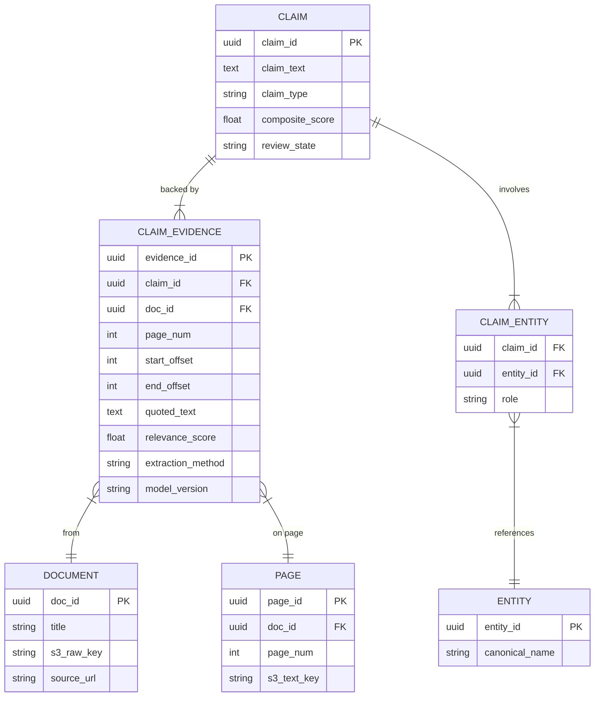
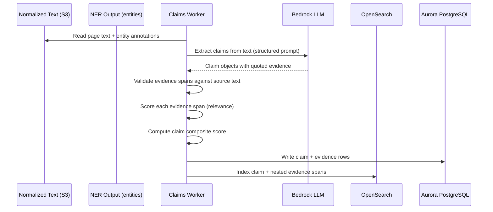
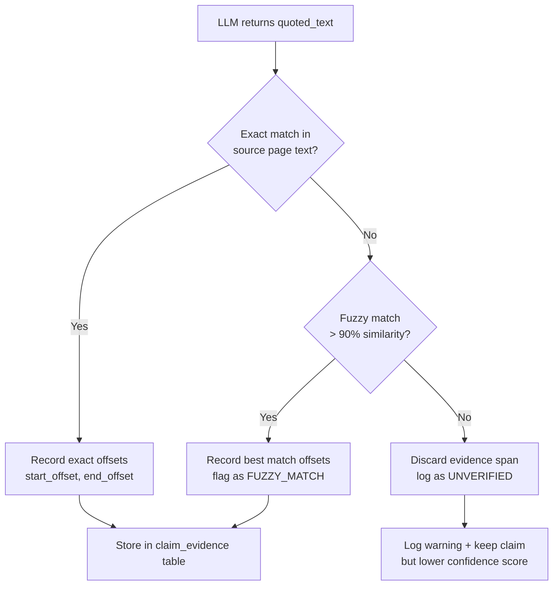
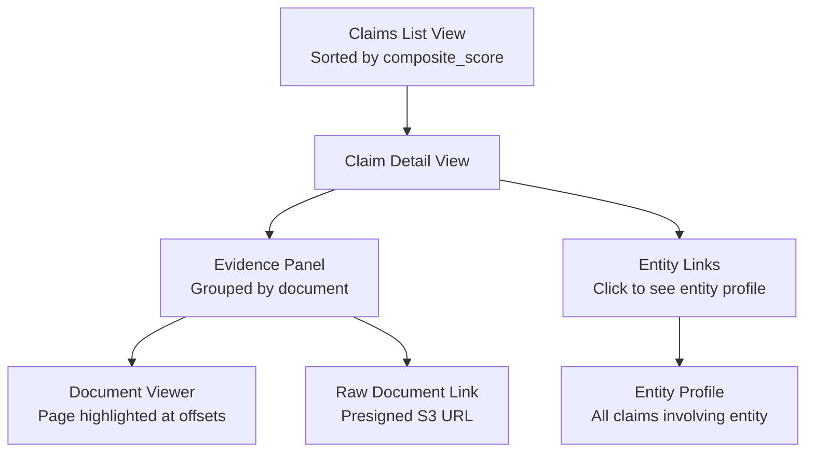
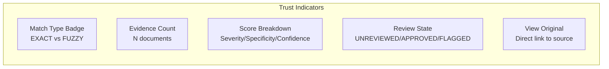

# Claims-Evidence Linking — Design Document

## Problem

Every claim extracted from the Epstein files must be traceable back to its exact source material. Users need to verify claims by reading the original text themselves. Without this, the system is just another unsourced aggregator.

**Goal:** Every claim has a verifiable chain: `claim → evidence spans → pages → documents → raw files in S3`.

---

## Evidence Chain Model



---

## How Evidence Links Are Created

### Pipeline Stage: Claims Worker



### Evidence Extraction Prompt Strategy

The Bedrock LLM is prompted to return structured JSON, not free-form text:

```json
{
  "claims": [
    {
      "claim_text": "normalized claim statement",
      "claim_type": "ALLEGATION|CONNECTION|FINANCIAL|TRAVEL|OTHER",
      "evidence": [
        {
          "quoted_text": "exact quote from source document",
          "page_num": 3,
          "relevance": "HIGH|MEDIUM|LOW"
        }
      ],
      "entities_involved": ["entity surface form 1", "entity surface form 2"]
    }
  ]
}
```

### Validation Step (Critical for Data Accuracy)

Every evidence span returned by the LLM is **validated against the source text**:



This prevents hallucinated quotes from becoming evidence.

---

## Aurora Schema for Evidence Linking

```sql
-- Evidence spans linking claims to specific document locations
CREATE TABLE claim_evidence (
    evidence_id       UUID PRIMARY KEY,
    claim_id          UUID NOT NULL REFERENCES claims(claim_id),
    doc_id            UUID NOT NULL REFERENCES documents(doc_id),
    page_num          INT NOT NULL,
    start_offset      INT NOT NULL,
    end_offset        INT NOT NULL,
    quoted_text       TEXT NOT NULL,
    relevance_score   FLOAT NOT NULL,       -- 0.0 to 1.0
    match_type        VARCHAR(20) NOT NULL,  -- EXACT, FUZZY_MATCH, UNVERIFIED
    extraction_method VARCHAR(20) NOT NULL,  -- BEDROCK, RULE_BASED
    model_version     VARCHAR(50),
    created_at        TIMESTAMP NOT NULL DEFAULT NOW(),

    CONSTRAINT fk_page FOREIGN KEY (doc_id, page_num)
        REFERENCES pages(doc_id, page_num)
);

-- Junction table: which entities are involved in which claims
CREATE TABLE claim_entities (
    claim_id    UUID NOT NULL REFERENCES claims(claim_id),
    entity_id   UUID NOT NULL REFERENCES entities(entity_id),
    role        VARCHAR(30),  -- SUBJECT, OBJECT, WITNESS, MENTIONED
    PRIMARY KEY (claim_id, entity_id)
);

-- Indexes for fast lookups
CREATE INDEX idx_evidence_claim ON claim_evidence(claim_id);
CREATE INDEX idx_evidence_doc ON claim_evidence(doc_id);
CREATE INDEX idx_evidence_doc_page ON claim_evidence(doc_id, page_num);
CREATE INDEX idx_claim_entity_entity ON claim_entities(entity_id);
```

---

## OpenSearch Index: Claims with Nested Evidence

```json
{
  "mappings": {
    "properties": {
      "claim_id":         { "type": "keyword" },
      "claim_text":       { "type": "text", "analyzer": "standard" },
      "claim_type":       { "type": "keyword" },
      "composite_score":  { "type": "float" },
      "review_state":     { "type": "keyword" },
      "entity_ids":       { "type": "keyword" },
      "entity_names":     { "type": "keyword" },
      "evidence_doc_count": { "type": "integer" },
      "evidence_spans": {
        "type": "nested",
        "properties": {
          "evidence_id":    { "type": "keyword" },
          "doc_id":         { "type": "keyword" },
          "doc_title":      { "type": "text" },
          "page_num":       { "type": "integer" },
          "start_offset":   { "type": "integer" },
          "end_offset":     { "type": "integer" },
          "quoted_text":    { "type": "text" },
          "relevance_score": { "type": "float" },
          "match_type":     { "type": "keyword" }
        }
      }
    }
  }
}
```

### Key Queries

**Find all evidence for a claim:**
```json
{
  "query": { "term": { "claim_id": "uuid-here" } },
  "_source": ["claim_text", "evidence_spans"]
}
```

**Find claims backed by a specific document:**
```json
{
  "query": {
    "nested": {
      "path": "evidence_spans",
      "query": { "term": { "evidence_spans.doc_id": "uuid-here" } }
    }
  }
}
```

**Find claims involving a specific entity, sorted by evidence density:**
```json
{
  "query": { "term": { "entity_ids": "entity-uuid" } },
  "sort": [{ "evidence_doc_count": "desc" }]
}
```

**Cross-corroborated claims (mentioned in 3+ documents):**
```json
{
  "query": {
    "range": { "evidence_doc_count": { "gte": 3 } }
  },
  "sort": [{ "composite_score": "desc" }]
}
```

---

## API Endpoints for Evidence Linking

| Method | Path | Description |
|--------|------|-------------|
| `GET` | `/api/v1/claims/{id}` | Claim detail with all evidence spans |
| `GET` | `/api/v1/claims/{id}/evidence` | Paginated evidence spans for a claim |
| `GET` | `/api/v1/documents/{id}/claims` | All claims backed by evidence from this doc |
| `GET` | `/api/v1/documents/{id}/pages/{pageNum}/claims` | Claims referencing a specific page |
| `GET` | `/api/v1/entities/{id}/claims` | Claims involving this entity |
| `GET` | `/api/v1/claims/corroborated` | Claims with evidence from 3+ documents |

### Example API Response: `GET /api/v1/claims/{id}`

```json
{
  "claim_id": "uuid",
  "claim_text": "Subject traveled to Location on Date",
  "claim_type": "TRAVEL",
  "composite_score": 0.87,
  "review_state": "APPROVED",
  "scoring": {
    "severity": 0.8,
    "specificity": 0.9,
    "evidence_density": 0.85,
    "confidence": 0.92
  },
  "entities": [
    { "entity_id": "uuid", "canonical_name": "Person Name", "role": "SUBJECT" },
    { "entity_id": "uuid", "canonical_name": "Location Name", "role": "MENTIONED" }
  ],
  "evidence": [
    {
      "evidence_id": "uuid",
      "document": {
        "doc_id": "uuid",
        "title": "Flight Log Page 47",
        "source_url": "https://...",
        "content_url": "/api/v1/documents/uuid/content"
      },
      "page_num": 3,
      "quoted_text": "Exact quote from source...",
      "relevance_score": 0.95,
      "match_type": "EXACT"
    },
    {
      "evidence_id": "uuid",
      "document": {
        "doc_id": "uuid-2",
        "title": "Deposition Transcript",
        "source_url": "https://...",
        "content_url": "/api/v1/documents/uuid-2/content"
      },
      "page_num": 12,
      "quoted_text": "Corroborating quote from different document...",
      "relevance_score": 0.88,
      "match_type": "EXACT"
    }
  ],
  "evidence_doc_count": 2
}
```

---

## Frontend: Evidence Viewer UX



### UI Components

1. **Claims List** — sortable by score, filterable by type/entity/review state
2. **Claim Card** — shows claim text, score breakdown, entity badges, evidence count
3. **Evidence Panel** — accordion grouped by source document, shows quoted text with page links
4. **Inline Document Viewer** — renders page text with highlighted evidence spans (using start/end offsets)
5. **"View Original" button** — opens presigned S3 URL to raw PDF at the correct page

---

## Confidence & Trust Signals

The UI surfaces trust signals so users can assess claim reliability:



| Signal | Display | Purpose |
|--------|---------|---------|
| Match type | Green "Exact Match" / Yellow "Fuzzy Match" badge | Shows if quote was verified in source |
| Evidence count | "Corroborated by N documents" | Multi-source claims are more reliable |
| Score breakdown | Expandable tooltip with 4 factors | Transparency in ranking |
| Review state | Badge on claim card | Shows editorial review status |
| "View original" | Button per evidence span | User can verify themselves |

---

## Data Integrity Safeguards

| Safeguard | Implementation |
|-----------|---------------|
| **No hallucinated evidence** | Every LLM quote validated against source text; unverified spans discarded |
| **Offset verification** | `start_offset`/`end_offset` checked against actual page text length |
| **Idempotent processing** | Re-running pipeline with same input + model version produces same claim/evidence links |
| **Audit trail** | `extraction_method`, `model_version`, `match_type` stored on every evidence row |
| **Foreign key integrity** | Aurora enforces `claim → document → page` referential integrity |
| **Review workflow** | Claims default to UNREVIEWED; only APPROVED claims shown in default UI view |
