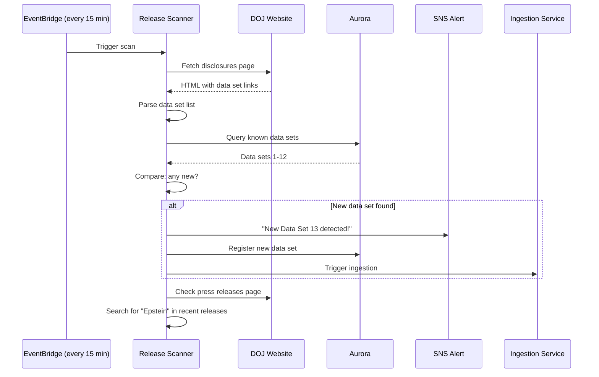
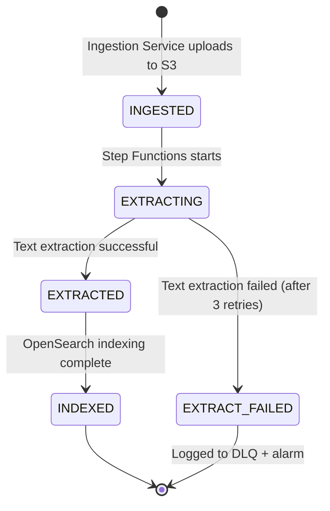
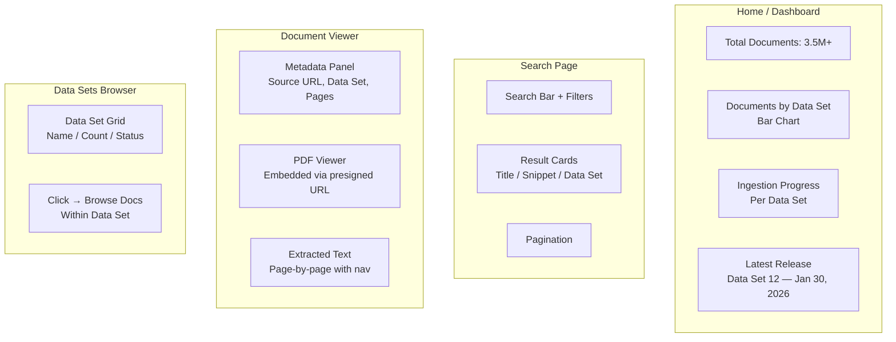
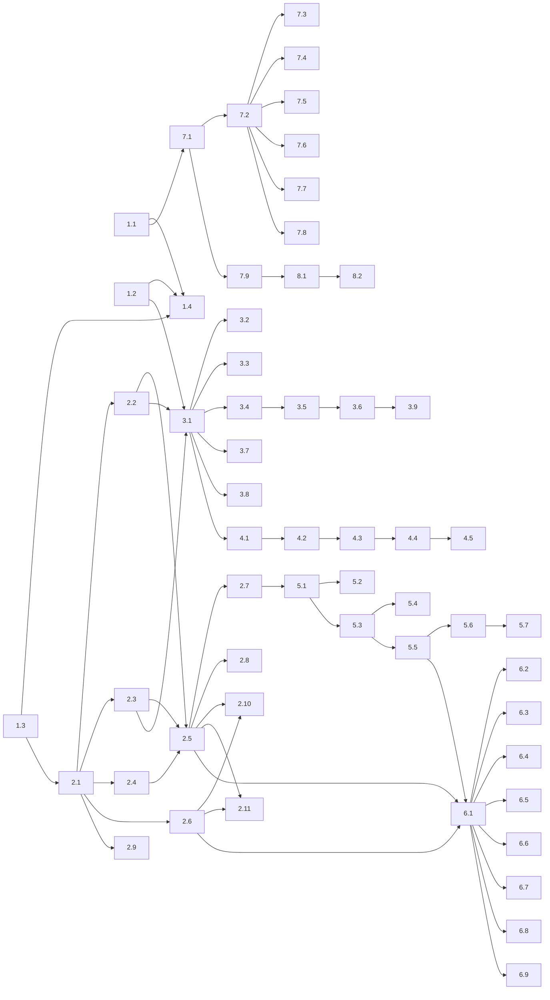

# EpsteinBrowser — Project Plan

## Phase 1: Document Ingestion, Browsing & New Release Detection

**Goal:** Build a working system that ingests all Epstein files from the DOJ, stores them in S3, extracts text, indexes them for search, and provides a basic browsing/search UI. Also: be the first to detect new document releases.

---

## Data Sources

### Primary: DOJ Epstein Library

| Source | URL | Volume |
|--------|-----|--------|
| DOJ Disclosures (Data Sets 1-12) | `justice.gov/epstein/doj-disclosures` | ~3.5M pages |
| DOJ Court Records (Giuffre v. Maxwell) | `justice.gov/epstein/court-records` | Dockets 001–1334 |
| DOJ FOIA Records | `justice.gov/epstein/foia` | CBP records + others |

### Secondary (Phase 1 stretch)

| Source | URL | Volume |
|--------|-----|--------|
| FBI Vault | `vault.fbi.gov/jeffrey-epstein` | 22 PDF parts |
| CourtListener (RECAP) | `courtlistener.com/docket/15887848/` | Varies |
| Archive.org mirrors | `archive.org/details/combined-all-epstein-files` | Mirrors of above |

### URL Patterns (DOJ Disclosures)

```
Listing pages:  justice.gov/epstein/doj-disclosures/data-set-{N}-files?page={P}
Individual PDFs: justice.gov/epstein/files/DataSet%20{N}/EFTA{8digits}.pdf
ZIP downloads:  justice.gov/epstein/files/DataSet%20{N}.zip  (sets 1-8, 12)
```

- Data Sets 9-11: ZIPs removed, must scrape individual PDFs from listing pages
- Data Set 9 alone has ~1M individual PDFs
- Site uses Akamai bot protection — need cookie/session handling

---

## Phase 1 Architecture

```mermaid
graph TB
    subgraph "Ingestion (Phase 1)"
        SCAN[Release Scanner<br/>Scheduled every 15 min]
        ING[Ingestion Service<br/>Spring Boot on Fargate]
    end

    subgraph "Processing (Phase 1)"
        SF[Step Functions]
        ETW[Extract Text Worker<br/>Apache Tika + Tesseract OCR]
    end

    subgraph "Data Layer"
        S3[(S3<br/>raw/ text/)]
        PG[(Aurora PostgreSQL<br/>Document Registry)]
        OS[(OpenSearch<br/>documents index)]
    end

    subgraph "API"
        API[Query API<br/>Spring Boot on Fargate]
        ALB[ALB]
    end

    subgraph "Frontend"
        FE[React + Vite + TS<br/>Amplify]
    end

    subgraph "Alerting"
        SNS_NEW[SNS: New Release Alert]
    end

    SCAN -->|Check DOJ for new data sets| DOJ[DOJ Website]
    SCAN -->|New release detected| SNS_NEW
    SCAN -->|Trigger| ING

    ING -->|Fetch PDFs| DOJ
    ING -->|Store| S3
    ING -->|Register| PG
    S3 -->|Trigger| SF
    SF --> ETW
    ETW -->|Extract text| S3
    ETW -->|Index| OS
    ETW -->|Update state| PG

    FE --> ALB --> API
    API --> OS & PG & S3
```

---

## Tasks

### 1. Project Scaffolding

| Task | Description |
|------|-------------|
| 1.1 | Initialize `frontend/` — React + Vite + TypeScript, Vitest, ESLint, Amplify config (`amplify.yml`) |
| 1.2 | Initialize `backend/` — Spring Boot multi-module Gradle project (api, ingestion, workers, common) |
| 1.3 | Initialize `infrastructure/` — Terraform modules structure with dev/staging environments |
| 1.4 | Set up CI — Amplify build on push to develop, Gradle build/test in GitHub Actions |

### 2. Infrastructure (Terraform)

| Task | Description |
|------|-------------|
| 2.1 | VPC module — public/private/isolated subnets, NAT gateway, 2 AZs |
| 2.2 | S3 module — document bucket with `raw/`, `text/`, `derived/` prefixes, versioning, lifecycle rules |
| 2.3 | Aurora PostgreSQL module — Serverless v2 (scales to zero in dev), private subnet |
| 2.4 | OpenSearch module — single-node dev, multi-node staging, VPC endpoint |
| 2.5 | ECS module — Fargate cluster, task definitions for API + ingestion + extract-text worker |
| 2.6 | ALB module — HTTPS listener, WAF, health checks |
| 2.7 | Step Functions module — document processing state machine |
| 2.8 | SQS module — extract-text queue + DLQ |
| 2.9 | ECR module — repositories for each container image |
| 2.10 | Monitoring module — CloudWatch log groups, alarms, SNS topic for alerts |
| 2.11 | IAM module — task roles per service (least privilege) |

### 3. Ingestion Service (Spring Boot)

| Task | Description |
|------|-------------|
| 3.1 | **DOJ Scraper** — crawl `data-set-{N}-files?page={P}` listing pages, extract PDF URLs. Handle Akamai bot protection (cookie/session management, rate limiting, exponential backoff) |
| 3.2 | **ZIP Downloader** — for data sets with ZIP files available (1-8, 12), download and unpack |
| 3.3 | **PDF Downloader** — for data sets without ZIPs (9-11), download individual PDFs from listing pages. Parallelized with configurable concurrency |
| 3.4 | **Deduplication** — hash each file (SHA-256), check against Aurora `documents.file_hash` before storing |
| 3.5 | **S3 Upload** — store raw PDFs under `raw/{data_set}/{EFTA_number}.pdf` |
| 3.6 | **Aurora Registration** — insert into `documents` table (doc_id, source_url, file_hash, s3_raw_key, data_set, processing_state=INGESTED) |
| 3.7 | **Court Records Scraper** — enumerate docket PDFs from `justice.gov/epstein/court-records` (001.pdf through 1334-1.pdf) |
| 3.8 | **FOIA Records Scraper** — download CBP records (Epstein Records 1-4.pdf) |
| 3.9 | **Progress Tracking** — track ingestion progress per data set in Aurora (total docs, downloaded, failed, percentage) |

### 4. New Release Scanner

| Task | Description |
|------|-------------|
| 4.1 | **Scheduled Scanner** — runs every 15 minutes on Fargate (or EventBridge-triggered Lambda). Checks for new data sets on DOJ disclosures page |
| 4.2 | **Detection Logic** — compare known data set count in Aurora vs data sets listed on DOJ page. Also check DOJ press releases RSS/page for "Epstein" mentions |
| 4.3 | **Alert on New Release** — publish to SNS topic when new data set detected. Include data set number, estimated document count, URL |
| 4.4 | **Auto-Ingest Trigger** — optionally auto-start ingestion of new data set upon detection |
| 4.5 | **Multi-Source Monitoring** — also check: DOJ FOIA page for new agency records, CourtListener API for new filings on Epstein-related dockets, House Oversight releases page |

### Detection Flow



### 5. Text Extraction Worker

| Task | Description |
|------|-------------|
| 5.1 | **Tika Integration** — Apache Tika for PDF text extraction (handles text-layer PDFs) |
| 5.2 | **OCR Fallback** — Tesseract OCR for image-only PDFs (scanned documents). Detect when Tika returns empty/minimal text |
| 5.3 | **Page Splitting** — extract text per page, store as individual files in S3 `text/{doc_id}/page_{N}.txt` |
| 5.4 | **Aurora Page Map** — insert into `pages` table (doc_id, page_num, s3_text_key, char_offsets) |
| 5.5 | **OpenSearch Indexing** — index full document text + metadata into `documents` index |
| 5.6 | **State Update** — update `documents.processing_state` to EXTRACTED (or FAILED with error details) |
| 5.7 | **Step Functions Integration** — wire as a step in the state machine, with retry on failure (max 3 attempts) |

### Processing Pipeline (Phase 1)



### 6. Query API (Spring Boot)

| Task | Description |
|------|-------------|
| 6.1 | **Search Endpoint** — `GET /api/v1/search?q={query}&page={p}&size={s}&dataSet={ds}&dateFrom={d}&dateTo={d}` — full-text search via OpenSearch with filters and pagination |
| 6.2 | **Document Detail** — `GET /api/v1/documents/{id}` — metadata from Aurora + OpenSearch |
| 6.3 | **Document Content** — `GET /api/v1/documents/{id}/content` — generate presigned S3 URL for raw PDF |
| 6.4 | **Document Pages** — `GET /api/v1/documents/{id}/pages` — list of pages with extracted text |
| 6.5 | **Document Page Text** — `GET /api/v1/documents/{id}/pages/{pageNum}` — extracted text for a specific page |
| 6.6 | **Stats Overview** — `GET /api/v1/stats/overview` — total docs, pages, docs per data set, ingestion progress |
| 6.7 | **Browse Data Sets** — `GET /api/v1/datasets` — list all data sets with doc counts, ingestion status |
| 6.8 | **Health Check** — `GET /api/v1/health` — API + Aurora + OpenSearch connectivity |
| 6.9 | **CORS + Error Handling** — proper CORS for Amplify frontend, standardized error responses |

### 7. Frontend (React + Vite + TypeScript)

| Task | Description |
|------|-------------|
| 7.1 | **Project Setup** — Vite + React + TypeScript + TailwindCSS + React Router + React Query |
| 7.2 | **Layout Shell** — responsive nav bar, sidebar, main content area, footer |
| 7.3 | **Home / Dashboard** — total document count, docs per data set (bar chart), ingestion progress, latest release info |
| 7.4 | **Search Page** — search bar with autocomplete, result cards (title, snippet with highlights, data set, page count), pagination, filters (data set, date range) |
| 7.5 | **Document Viewer** — metadata panel, embedded PDF viewer (presigned URL), extracted text view with page navigation |
| 7.6 | **Data Sets Browser** — grid/list of all data sets with counts, click to browse docs within a set |
| 7.7 | **New Release Banner** — if scanner detects new release, show banner at top of site |
| 7.8 | **Loading States + Error Handling** — skeleton loaders, error boundaries, retry buttons |
| 7.9 | **Amplify Config** — `amplify.yml` for build/deploy from `frontend/` directory |

### Frontend Wireframe



### 8. Amplify Deployment

| Task | Description |
|------|-------------|
| 8.1 | `amplify.yml` — build spec pointing to `frontend/`, Node 20, `npm run build`, output `dist/` |
| 8.2 | Environment variables — API endpoint URL per environment |
| 8.3 | Custom domain setup (if applicable) |

---

## Task Dependencies



---

## Phase 1 Milestones

| Milestone | Tasks | Definition of Done |
|-----------|-------|-------------------|
| **M1: Scaffolding** | 1.1–1.4 | All projects build, CI green, empty deploys work |
| **M2: Infrastructure** | 2.1–2.11 | `terraform apply` creates all resources in dev |
| **M3: Ingestion** | 3.1–3.9 | All 12 DOJ data sets ingested into S3, registered in Aurora |
| **M4: Release Scanner** | 4.1–4.5 | Scanner running every 15 min, SNS alert tested |
| **M5: Text Extraction** | 5.1–5.7 | All ingested docs have extracted text in S3 + OpenSearch |
| **M6: API** | 6.1–6.9 | All endpoints working, search returns results |
| **M7: Frontend** | 7.1–7.9 | Full browsing/search UI deployed on Amplify |
| **M8: Production** | 8.1–8.3 | Staging environment fully operational end-to-end |

---

## Risk Mitigation

| Risk | Impact | Mitigation |
|------|--------|-----------|
| Akamai bot protection blocks scraper | Can't download docs | Implement session/cookie handling, rate limiting (max 5 req/s), exponential backoff. Fallback to Archive.org mirrors or community torrents for large data sets |
| Data Set 9 has ~1M PDFs | Ingestion takes very long | Parallelize downloads (configurable concurrency), use ZIP when available, track progress per data set |
| OCR quality on scanned docs | Poor text extraction | Use Tesseract with preprocessing (deskew, denoise). Track OCR confidence scores. Flag low-quality extractions for review |
| DOJ site structure changes | Scraper breaks | Abstract scraping logic behind interfaces. Monitor scraper health. Alert on consecutive failures |
| OpenSearch storage fills up | Search breaks | Monitor free storage alarm, configure index lifecycle policies, shard per data set |
| Cost (3.5M pages in OpenSearch) | High AWS bill | Use dev-sized instances in dev. Estimate storage: ~3.5M pages × ~2KB avg text = ~7GB in OpenSearch. Manageable. S3 raw PDFs will be the largest cost |

---

## Phase 2 Preview (Not in scope for Phase 1)

- Entity extraction (NER) + canonicalization
- Mentions indexing + "Top Names" dashboard
- Claims extraction + evidence linking
- Bedrock AI enrichment
- Cognito authentication
- Admin UI for entity merges + claim review
